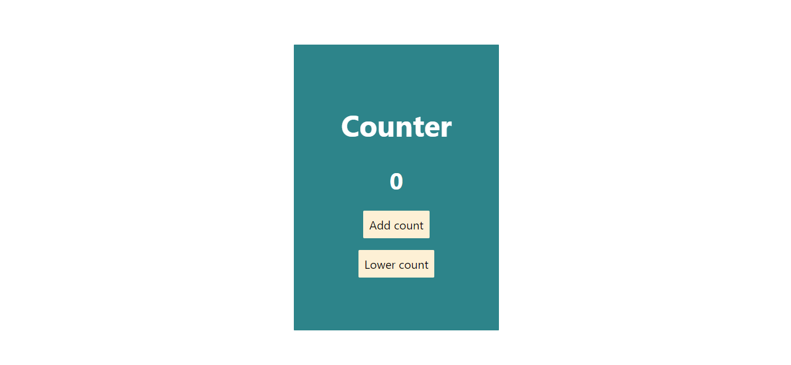
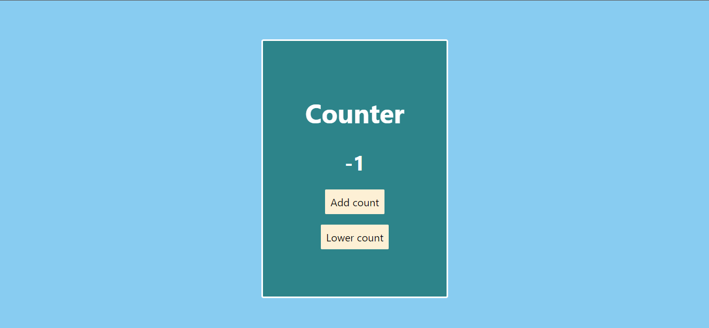

# Counter

This simple project is made with HTML, CSS, and JS. The usage of this project is to count and also change the background when its positive or negative.

When number is 0:

When number is positive:

When number is negative:
